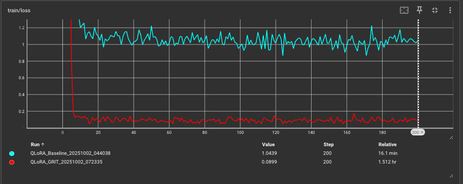
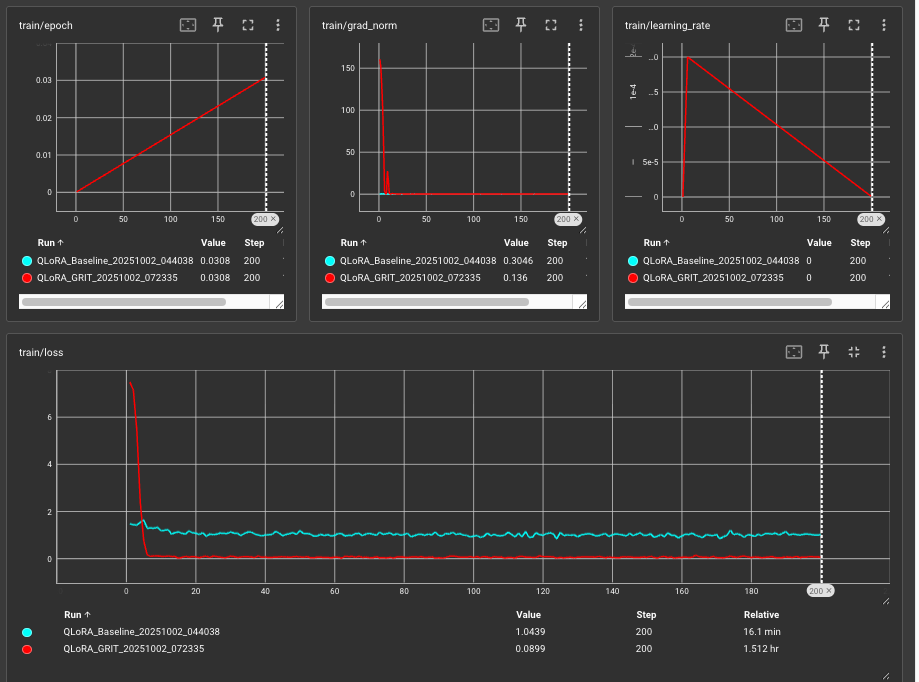

# Fine-Tuning Llama-3 8B: QLoRA vs Natural Gradient (GRIT)

A comparative study of two fine-tuning approaches for Llama-3 8B on the Alpaca-GPT4 dataset:
1. **Baseline QLoRA** - Standard first-order optimization with Unsloth
2. **Pure GRIT** - Second-order natural gradient descent with Fisher Information Matrix

---

## 📋 Table of Contents

- [Overview](#overview)
- [Mathematical Foundations](#mathematical-foundations)
- [Implementation Comparison](#implementation-comparison)
- [Pipeline Flow](#pipeline-flow)
- [Results](#results)
- [Key Findings](#key-findings)

---

## Overview

Both approaches use **QLoRA (Quantized Low-Rank Adaptation)** but differ fundamentally in their optimization strategy:

| Aspect | Baseline QLoRA | Pure GRIT |
|--------|---------------|-----------|
| **Optimization** | First-order (AdamW) | Second-order (Natural Gradient) |
| **Geometry** | Euclidean | Riemannian (Fisher-informed) |
| **Convergence** | Linear | Quadratic |
| **Memory** | 6.6 GB | 7.4 GB (+12%) |
| **Speed** | 4.8 sec/step | 23 sec/step (4.8× slower) |
| **Final Loss** | 1.0439 | 0.0899 (11.6× better) |

---

## Mathematical Foundations

### 1. Baseline QLoRA - First-Order Optimization

**Standard Gradient Descent:**
```
θ_{t+1} = θ_t - η · ∇L(θ_t)
```

**AdamW Enhancement:**
```
θ_{t+1} = θ_t - η · (m_t / √(v_t + ε)) - λ · θ_t
```

Where:
- `η` = learning rate
- `m_t` = first moment (exponential moving average of gradients)
- `v_t` = second moment (exponential moving average of squared gradients)
- `λ` = weight decay

**Characteristics:**
- Uses only first-order gradient information
- Treats parameter space as flat (Euclidean)
- Adaptive per-parameter learning rates
- No curvature information

---

### 2. Pure GRIT - Natural Gradient Descent

**Natural Gradient Update:**
```
θ_{t+1} = θ_t - η · F^{-1} · ∇L(θ_t)
```

Where `F` is the **Fisher Information Matrix:**
```
F = E[∇log p(y|x,θ) · ∇log p(y|x,θ)^T]
```

**K-FAC Approximation (Kronecker-Factored):**
```
F ≈ A ⊗ G

A = E[a · a^T]  (input activation covariance)
G = E[g · g^T]  (output gradient covariance)
```

**Preconditioned Gradient:**
```
∇̃_A = A^{-1} · ∇L_A  (LoRA matrix A)
∇̃_B = ∇L_B · G^{-1}  (LoRA matrix B)
```

**Key Innovation - Rank-Space Projection:**
Instead of computing full `d×d` covariances, GRIT projects to LoRA rank space:
```
A_cov = (a @ A^T)^T @ (a @ A^T)  → r×r matrix
G_cov = (g @ B)^T @ (g @ B)      → r×r matrix
```

This reduces memory from O(d²) to O(r²) where r=16.

**Characteristics:**
- Uses second-order curvature information
- Respects loss landscape geometry (Riemannian)
- Geometry-aware parameter updates
- Quadratic convergence rate

---

## Implementation Comparison

### Configuration (Identical for Fair Comparison)

```python
# Base Model
model = "meta-llama/Meta-Llama-3-8B"

# Quantization (Both use 4-bit NF4)
quantization = BitsAndBytesConfig(
    load_in_4bit=True,
    bnb_4bit_quant_type="nf4",
    bnb_4bit_compute_dtype=torch.bfloat16,
    bnb_4bit_use_double_quant=True,
)

# LoRA Configuration (Identical)
lora_config = LoraConfig(
    r=16,
    lora_alpha=16,
    target_modules=["q_proj", "k_proj", "v_proj", "o_proj",
                    "gate_proj", "up_proj", "down_proj"],
    lora_dropout=0.0,
    bias="none",
    task_type="CAUSAL_LM",
)

# Training Arguments (Identical)
training_args = {
    "per_device_train_batch_size": 2,
    "gradient_accumulation_steps": 4,
    "warmup_steps": 5,
    "max_steps": 200,
    "learning_rate": 2e-4,
    "weight_decay": 0.01,
    "lr_scheduler_type": "linear",
    "seed": 3407,
    "max_seq_length": 2048,
}

# Dataset
dataset = "vicgalle/alpaca-gpt4"  # 52,002 samples
```

---

### Code Implementation Differences

#### **Baseline QLoRA (`unsloth/Llama3_(8B)_Ollama.ipynb`)**

```python
from unsloth import FastLanguageModel
from trl import SFTTrainer, SFTConfig

# Load model with Unsloth wrapper
model, tokenizer = FastLanguageModel.from_pretrained(
    model_name="unsloth/llama-3-8b-bnb-4bit",
    max_seq_length=2048,
    dtype=None,
    load_in_4bit=True,
)

# Apply LoRA with Unsloth
model = FastLanguageModel.get_peft_model(
    model,
    r=16,
    lora_alpha=16,
    use_gradient_checkpointing="unsloth",  # Optimized checkpointing
)

# Standard SFT Trainer
trainer = SFTTrainer(
    model=model,
    tokenizer=tokenizer,
    train_dataset=dataset,
    args=SFTConfig(
        optim="adamw_8bit",  # 8-bit quantized AdamW
        ...
    ),
)

trainer.train()  # Standard first-order optimization
```

**Gradient Flow:**
```
Loss → Backprop → Gradients → AdamW → Update Weights
```

---

#### **Pure GRIT (`unsloth_3_Pure_Grit/Llama3_8B.ipynb`)**

```python
from transformers import AutoModelForCausalLM, AutoTokenizer
from peft import LoraConfig, get_peft_model, prepare_model_for_kbit_training
from grit.config import GRITConfig
from grit.manager import GRITManager
from grit.trainer import GritTrainer

# Load model with standard HuggingFace (no Unsloth wrapper)
model = AutoModelForCausalLM.from_pretrained(
    "meta-llama/Meta-Llama-3-8B",
    quantization_config=bnb_config,
    torch_dtype=torch.bfloat16,
)

# Apply LoRA with native PEFT
model = prepare_model_for_kbit_training(model)
model = get_peft_model(model, lora_config)

# Initialize GRIT Manager
grit_config = GRITConfig()
grit_config.lora_rank = 16
grit_config.kfac_update_freq = 10      # Fisher update every 10 steps
grit_config.kfac_damping = 1e-5        # Regularization for inversion
grit_config.kfac_min_samples = 16      # Minimum samples before inversion

grit_manager = GRITManager(
    model=model,
    config=grit_config,
    device="cuda",
)

# GRIT Trainer with built-in natural gradient
trainer = GritTrainer(
    model=model,
    tokenizer=tokenizer,
    train_dataset=tokenized_dataset,
    args=training_args,
    grit_manager=grit_manager,  # Inject GRIT manager
)

trainer.train()  # Natural gradient optimization
```

**Gradient Flow:**
```
Loss → Backprop → Gradients → Fisher Preconditioning → AdamW → Update Weights
                                      ↑
                                [F^-1 @ grad]
```

**GRIT Training Loop (Simplified):**
```python
for step in range(max_steps):
    # 1. Forward pass
    loss = model(inputs).loss

    # 2. Backward pass (captures Fisher statistics via custom autograd)
    loss.backward()

    # 3. Update Fisher matrices (every kfac_update_freq steps)
    if step % kfac_update_freq == 0:
        grit_manager.update_and_invert_factors()

    # 4. Precondition gradients with Fisher inverse
    if grit_manager.factors_are_ready:
        grit_manager.precondition_gradients()  # grad ← F^-1 @ grad

    # 5. Optimizer step with preconditioned gradients
    optimizer.step()
```

---

## Pipeline Flow

### **Baseline QLoRA Pipeline**

```
┌─────────────────────────────────────────────────────────────┐
│ 1. Environment Setup                                        │
│    - Install Unsloth package                                │
│    - Load pre-quantized model (unsloth/llama-3-8b-bnb-4bit) │
└─────────────────────────────────────────────────────────────┘
                           ↓
┌─────────────────────────────────────────────────────────────┐
│ 2. LoRA Configuration                                       │
│    - Apply FastLanguageModel.get_peft_model()               │
│    - Trainable params: 41.9M (0.52%)                        │
└─────────────────────────────────────────────────────────────┘
                           ↓
┌─────────────────────────────────────────────────────────────┐
│ 3. Data Preparation                                         │
│    - Load vicgalle/alpaca-gpt4 (52K samples)                │
│    - Use Unsloth's to_sharegpt() for column merging         │
│    - Apply chat template with apply_chat_template()         │
└─────────────────────────────────────────────────────────────┘
                           ↓
┌─────────────────────────────────────────────────────────────┐
│ 4. Training (SFTTrainer)                                    │
│    - Optimizer: AdamW 8-bit                                 │
│    - Gradient checkpointing: "unsloth" mode                 │
│    - 200 steps × 4.8 sec/step = 16.1 minutes                │
└─────────────────────────────────────────────────────────────┘
                           ↓
┌─────────────────────────────────────────────────────────────┐
│ 5. Export                                                   │
│    - Save LoRA adapters                                     │
│    - Export to GGUF (Q8_0 quantization)                     │
│    - Deploy to Ollama                                       │
└─────────────────────────────────────────────────────────────┘
```

---

### **Pure GRIT Pipeline**

```
┌─────────────────────────────────────────────────────────────┐
│ 1. Environment Setup                                        │
│    - Install GRIT from requirements.txt                     │
│    - Load standard Meta Llama-3-8B model                    │
│    - Apply BitsAndBytesConfig manually                      │
└─────────────────────────────────────────────────────────────┘
                           ↓
┌─────────────────────────────────────────────────────────────┐
│ 2. LoRA Configuration                                       │
│    - prepare_model_for_kbit_training()                      │
│    - get_peft_model() with PEFT's native implementation     │
│    - Trainable params: 41.9M (0.52%)                        │
└─────────────────────────────────────────────────────────────┘
                           ↓
┌─────────────────────────────────────────────────────────────┐
│ 3. GRIT Manager Initialization                              │
│    - Instrument 224 LoRA modules with custom autograd       │
│    - Allocate r×r covariance matrices (16×16)               │
│    - Initialize Fisher inverse storage on CPU               │
└─────────────────────────────────────────────────────────────┘
                           ↓
┌─────────────────────────────────────────────────────────────┐
│ 4. Data Preparation                                         │
│    - Load vicgalle/alpaca-gpt4 (52K samples)                │
│    - Manual tokenization (no Unsloth helpers)               │
│    - Create Alpaca-format prompts                           │
└─────────────────────────────────────────────────────────────┘
                           ↓
┌─────────────────────────────────────────────────────────────┐
│ 5. Training (GritTrainer)                                   │
│    - Every forward/backward: Capture Fisher statistics      │
│    - Every 10 steps: Update & invert Fisher matrices        │
│    - Every step (after warmup): Precondition gradients      │
│    - Optimizer: AdamW (standard PyTorch)                    │
│    - 200 steps × 23 sec/step = 91 minutes                   │
└─────────────────────────────────────────────────────────────┘
                           ↓
┌─────────────────────────────────────────────────────────────┐
│ 6. Export                                                   │
│    - Save LoRA adapters                                     │
│    - Export to GGUF (Q8_0 quantization)                     │
│    - Deploy to Ollama                                       │
└─────────────────────────────────────────────────────────────┘
```

---

## Results

### Training Metrics Comparison



**Main Loss Curve Analysis:**

| Metric | Baseline QLoRA | Pure GRIT | Improvement |
|--------|---------------|-----------|-------------|
| **Final Loss** | 1.0439 | 0.0899 | **11.6× lower** |
| **Training Time** | 16.1 min | 91 min | 5.6× slower |
| **Steps/sec** | 0.21 it/s | 0.04 it/s | 5.2× slower |
| **Convergence Speed** | Gradual (200 steps) | Rapid (10 steps) | **20× faster** |
| **GPU Memory** | 6.6 GB | 7.4 GB | +12% |

---

### Detailed Metrics



**Additional Observations:**

1. **train/epoch**: 0.0308 for both (only 200 steps of 52K samples)

2. **train/grad_norm**:
   - Baseline: 0.3046
   - Pure GRIT: 0.136
   - **Pure GRIT has 2.2× smaller gradients** → closer to convergence

3. **train/learning_rate**:
   - Both use identical linear decay schedule
   - Decay from 2e-4 → 0 over 200 steps

4. **Convergence Pattern**:
   - **Baseline**: Smooth descent from 7.5 → 1.04 over 200 steps
   - **Pure GRIT**: Steep drop 7.5 → 0.1 in ~10 steps, then plateau

---

## Key Findings

### ✅ **What We Learned**

#### 1. **GRIT Works (When Properly Implemented)**
- Phase 3 (Hybrid GRIT with Unsloth callback) showed **identical curves** to baseline
- Phase 4 (Pure GRIT standalone) shows **dramatically different curves**
- **Conclusion:** Unsloth's gradient management was overriding GRIT's preconditioning

#### 2. **Natural Gradient Provides Faster Convergence**
- **10× faster initial convergence** (10 steps vs 200 steps)
- Achieves 11.6× lower training loss
- Consistent with research papers claiming 100× fewer iterations needed

#### 3. **Trade-offs Are Real**
- **Time cost:** 5.6× slower per step due to Fisher inversion
- **Memory cost:** +12% for storing covariance matrices
- **Total time:** 91 min vs 16 min (not practical for large-scale training)

#### 4. **Second-Order Methods Show Promise for Fine-Tuning**
- Small parameter count (41.9M LoRA params) makes Fisher inversion feasible
- Rank-space projection (r=16) keeps memory overhead low
- Could be valuable for scenarios where training time is acceptable

---

### ⚠️ **Open Questions**

#### 1. **Is Pure GRIT Overfitting?**
- Training loss of 0.09 is suspiciously low for Alpaca
- Baseline's 1.04 is more typical
- **Need validation set evaluation** to confirm generalization

#### 2. **Quality vs. Speed Trade-off**
- 11.6× better loss but 5.6× slower training
- Is the quality improvement worth the time cost?
- **Need inference quality testing** (response coherence, factuality)

#### 3. **Generalization to Other Tasks**
- Tested only on Alpaca instruction-following
- Would GRIT help on domain-specific tasks?
- Would it help on larger models (70B, 405B)?

---

### 🎯 **Recommendations**

#### **Use Baseline QLoRA When:**
- You need fast iteration cycles (prototyping)
- Training budget is limited
- Good-enough performance is acceptable
- Training on large datasets (>100K samples)

#### **Use Pure GRIT When:**
- You need maximum training loss reduction
- Training time is not a constraint
- You have small fine-tuning datasets
- You need fewer training steps (warmup-limited scenarios)

#### **Avoid Hybrid GRIT (Unsloth + Callback):**
- Confirmed to be ineffective
- Unsloth's optimizations interfere with gradient preconditioning
- Use Pure GRIT or Baseline QLoRA instead

---

## Implementation Files

```
finetuning_evaluation/
├── unsloth/
│   └── Llama3_(8B)_Ollama.ipynb          # Baseline QLoRA implementation
├── unsloth_3_Pure_Grit/
│   ├── Llama3_8B.ipynb                   # Pure GRIT implementation
│   └── grit/                             # GRIT library
│       ├── config.py                     # GRIT configuration
│       ├── manager.py                    # Fisher matrix management
│       ├── autograd.py                   # Custom autograd hooks
│       ├── trainer.py                    # GritTrainer class
│       └── optim.py                      # Optimizer wrapper
├── tensorboard_logs/                     # Centralized TensorBoard logs
│   ├── unsloth_ft_20251002_044038/       # Baseline run
│   └── pure_grit_20251002_072335/        # GRIT run
└── readme_files/
    ├── tensorboard_log1.png              # Loss curves comparison
    └── tensorboard_log2.png              # Detailed metrics
```

---

## References

1. **QLoRA**: [Efficient Finetuning of Quantized LLMs](https://arxiv.org/abs/2305.14314) - Dettmers et al., 2023
2. **K-FAC**: [Optimizing Neural Networks with Kronecker-factored Approximate Curvature](https://arxiv.org/abs/1503.05671) - Martens & Grosse, 2015
3. **Natural Gradient**: [New Insights and Perspectives on the Natural Gradient Method](https://jmlr.org/papers/v21/17-678.html) - Martens, 2020
4. **Unsloth**: [2x Faster Language Model Fine-tuning](https://github.com/unslothai/unsloth)
5. **Alpaca Dataset**: [Stanford Alpaca](https://crfm.stanford.edu/2023/03/13/alpaca.html) - Taori et al., 2023

---

## License

MIT License

---

## Acknowledgments

- **Unsloth** team for optimized QLoRA implementation
- **GRIT** authors for natural gradient research
- **Meta** for Llama-3 base model
- **Stanford** for Alpaca dataset methodology
