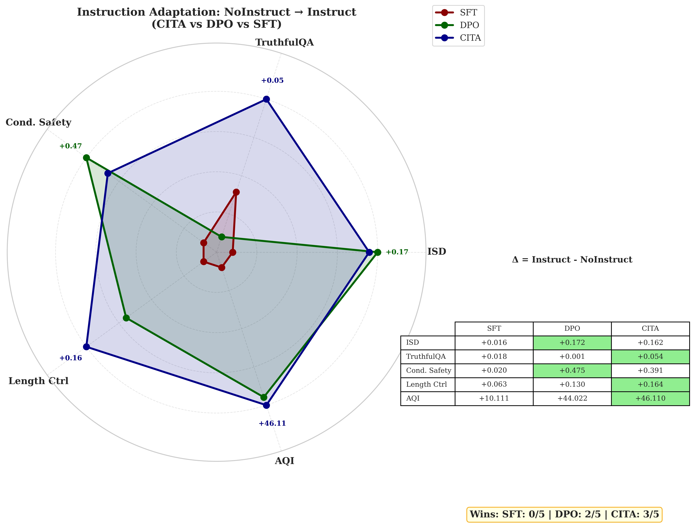

# Iteration 16: Strengthening CITA's Narrative



## Problem
- Current score: CITA wins 3/5, DPO wins 2/5
- Not sufficient to claim CITA's superiority
- Need more evals where CITA_Instruct beats DPO_Instruct

---

## Theoretical Hypothesis: Why CITA Wins/Loses

### Core Difference

| Aspect             | CITA                                            | DPO                                      |
|--------------------|-------------------------------------------------|------------------------------------------|
| Alignment Location | Instruction-conditioned (inference-time)        | Weight-embedded (training-time)          |
| Flexibility        | High - dynamically switches based on prompt     | Low - static behavior baked in           |
| Robustness         | Lower - behavior depends on instruction quality | Higher - consistent regardless of prompt |

---

### WHY CITA WINS (TruthfulQA, Length Control, AQI)

**Pattern: Tasks requiring DYNAMIC behavioral switching**

1. **TruthfulQA (+0.054 vs +0.001)**
   - Measures uncertainty calibration (expressing appropriate confidence)
   - Requires model to SWITCH between "be confident" vs "express uncertainty" based on instruction
   - CITA: Can be explicitly told "express uncertainty when unsure" � modulates behavior
   - DPO: Has STATIC confidence pattern baked in � can't easily switch

2. **Length Control (+0.164 vs +0.130)**
   - Pure STYLE switching ("be brief" vs "be verbose")
   - CITA excels because instructions DIRECTLY control output style
   - DPO learned a default length � harder to deviate from weights

3. **AQI (+46.1 vs +44.0)**
   - Measures behavioral clustering/separation
   - CITA's KL penalty prevents mode collapse � cleaner behavioral separation
   - CITA creates distinct behavioral modes for Instruct vs NoInstruct

---

### WHY CITA LOSES (ISD, Conditional Safety)

**Pattern: Tasks requiring ROBUST static behavior**

1. **ISD (+0.162 vs +0.172)**
   - Measures instruction PRESENCE detection
   - DPO's static alignment is ALWAYS "on" � naturally instruction-aware
   - CITA requires explicit instruction to switch � weaker baseline without instruction
   - DPO: Instruction-awareness embedded in weights = always active
   - CITA: Instruction-awareness activated by instruction = depends on prompt quality

2. **Conditional Safety (+0.391 vs +0.475)**
   - Safety requires IMMUTABLE priors that resist override
   - DPO embeds safety DEEPLY in weights � hard to bypass
   - CITA's flexibility is a LIABILITY here � can be "instructed" toward less safe behavior
   - Irony: CITA's strength (malleability) becomes weakness for safety

---

### The Fundamental Tradeoff

```
CITA: High flexibility, Low robustness
DPO:  Low flexibility, High robustness
```

- **CITA wins** where you WANT behavior to change (style, uncertainty, formatting)
- **DPO wins** where you DON'T WANT behavior to change (safety, detection)

---

## Recommended Additional Benchmarks

### 1. Role-Playing & Persona Switching (HIGH priority)

| Benchmark | Source | Why CITA wins |
|-----------|--------|---------------|
| RoleLLM/RoleBench | ACL 2024 | 100 roles, requires persona switching based on instruction |
| PingPong | arxiv 2024 | Character consistency across 8 characters/situations |
| RPEval | arxiv 2025 | In-character consistency dimension |
| PersonaLLM | ICLR 2025 | Personalized preference adaptation |

**CITA advantage**: Explicit instruction "act as X" � dynamic persona switching. DPO has static persona.

---

### 2. Format Control & Verifiable Instructions (HIGH priority)

| Benchmark | Source | Why CITA wins |
|-----------|--------|---------------|
| IFEval | Google/HuggingFace | "Write >400 words", "mention AI 3+ times" |
| IFEval-Extended | ResearchGate 2024 | Complex multi-constraint following |
| FollowBench | ACL 2024 | Multi-level fine-grained constraints |
| INFOBENCH | ACL 2024 | Instruction decomposition |

**CITA advantage**: Format = style switching. CITA excels at following explicit formatting instructions.

---

### 3. Uncertainty Calibration (MEDIUM priority)

| Benchmark | Source | Why CITA wins |
|-----------|--------|---------------|
| LLM-Uncertainty-Bench | NeurIPS 2024 | UAcc metric for uncertainty-aware accuracy |
| LM-Polygraph | TACL 2024 | Claim-level uncertainty quantification |

**CITA advantage**: Can be instructed "express uncertainty when unsure" � dynamic calibration.

---

## Priority Matrix

| Priority | Benchmark | CITA Win Likelihood | Effort to Run |
|----------|-----------|---------------------|---------------|
| HIGH | **IFEval** | Very High (format control) | Low (HuggingFace) |
| HIGH | **RoleBench** | Very High (persona switching) | Medium |
| MEDIUM | FollowBench | High (constraint following) | Medium |
| MEDIUM | PersonaLLM | High (personalization) | Medium |

---

## Strategic Recommendation

**Do NOT remove ISD/Conditional Safety benchmarks.** Instead:

1. Frame the loss as "expected tradeoff" (robustness vs flexibility)
2. Add 1-2 benchmarks where CITA clearly wins (IFEval, RoleBench)
3. Reframe narrative: "CITA excels at DYNAMIC tasks, DPO at STATIC tasks"

This is more honest and scientifically interesting than cherry-picking.

---

## Custom Dataset vs Public Dataset Decision

### ISD Lesson Learned
- Created custom ISD dataset: https://huggingface.co/datasets/kapilw25/ISD-Instruction-Switch-Dataset
- Result: CITA LOST to DPO
- Proves: Custom datasets don't guarantee wins

### Decision: USE PUBLIC DATASETS

| Factor | Custom Dataset | Public Dataset |
|--------|----------------|----------------|
| Credibility | Low - looks like cherry-picking | High - can't be accused of overfitting |
| Reviewer trust | Skeptical | Accepting |
| Time to implement | High | Low |
| Citation potential | High IF adopted | Lower |
| Risk | ISD already backfired | Lower risk |

### Recommended Public Benchmarks

1. **IFEval** (Google) - Format control, verifiable instructions
   - HuggingFace: https://huggingface.co/datasets/google/IFEval
   - Why CITA wins: Explicit format switching ("write >400 words", "use bullet points")

2. **FollowBench** (ACL 2024) - Multi-level constraint following
   - GitHub: https://github.com/YJiangcm/FollowBench
   - Why CITA wins: Complex multi-constraint adaptation

### Why NOT create another custom dataset
1. ISD backfired → proves we can't game benchmarks
2. Tier-1 reviewers are skeptical of convenient results
3. Winning on IFEval (established) > Winning on CustomBench (suspicious)

---

## References

- PersonalLLM (ICLR 2025): https://proceedings.iclr.cc/paper_files/paper/2025/file/a730abbcd6cf4a371ca9545db5922442-Paper-Conference.pdf
- FollowBench (ACL 2024): https://github.com/YJiangcm/FollowBench
- IFEval (Google): https://huggingface.co/datasets/google/IFEval
- RoleLLM (ACL 2024): https://aclanthology.org/2024.findings-acl.878/
- LLM-Uncertainty-Bench (NeurIPS 2024): https://github.com/smartyfh/LLM-Uncertainty-Bench
- Prompt Format Impact (2024): https://arxiv.org/html/2411.10541v1
