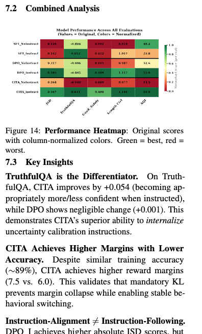

# Radar Chart Modification Plan

## Current State
- Original:


- Problem: Uses both columns in paper (too wide), redundant tables

## Command
```bash
python comparative_study/05_evaluation/generate_combined_plots.py
```

## Modifications

| # | Task | Details | Status |
|---|------|---------|--------|
| 1 | Remove delta table | Already in paper as Table 9 | Done |
| 2 | Remove ranking table | Already in paper as Table 10 | Done |
| 3 | Remove WINNER block | Green box: "Winner: CITA(95.6%) Margin over DPO: +25.1%" | Done |
| 4 | Increase font sizes | 18pt eval labels, 16pt annotations, 22pt title, 14pt y-ticks | Done |
| 5 | Move legend below | Single column layout instead of two columns | Done |
| 5.1 | Horizontal legend | `-o- CITA(95.6%), -o- DPO(70.5%), -o- GRPO(59.3%), -o- PPO(50.4%), -o- SFT(15.9%)` | Done |

## Output
```
outputs/evaluation/combined_plots/
  - radar_area.pdf  (for Overleaf)
  - radar_area.png  (for preview)
```

## File Modified
- `comparative_study/05_evaluation/eval_utils/plotting.py` (lines 837-1057)

---

# Task 2: Heatmap Modifications

## Goal
Replace Table 8 with heatmap figure that includes all 5 methods (SFT, DPO, PPO, GRPO, CITA)

## Current State


## Modifications

| # | Task | Details | Status |
|---|------|---------|--------|
| 1 | Add PPO & GRPO | Include all 10 model variants | Done |
| 2 | Update separators | Horizontal lines between each method group | Done |
| 3 | Increase font sizes | Cell: 14pt, X-axis: 14pt, Y-axis: 13pt, Title: 16pt | Done |

## Output
```
outputs/evaluation/combined_plots/
  - heatmap.pdf  (to replace Table 8)
  - heatmap.png  (for preview)
```

## File Modified
- `comparative_study/05_evaluation/eval_utils/plotting.py` (lines 1083-1262)
