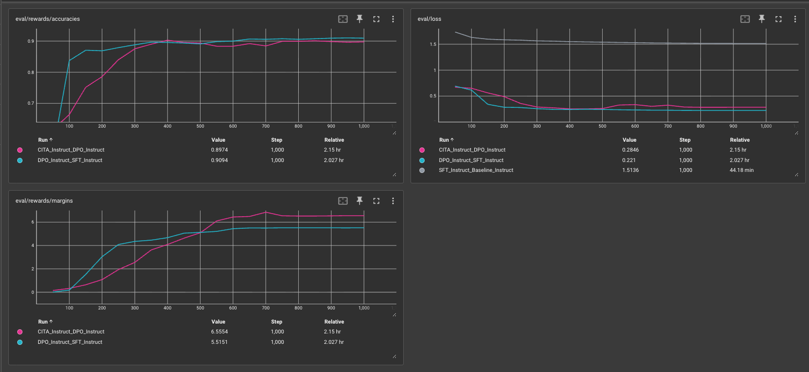
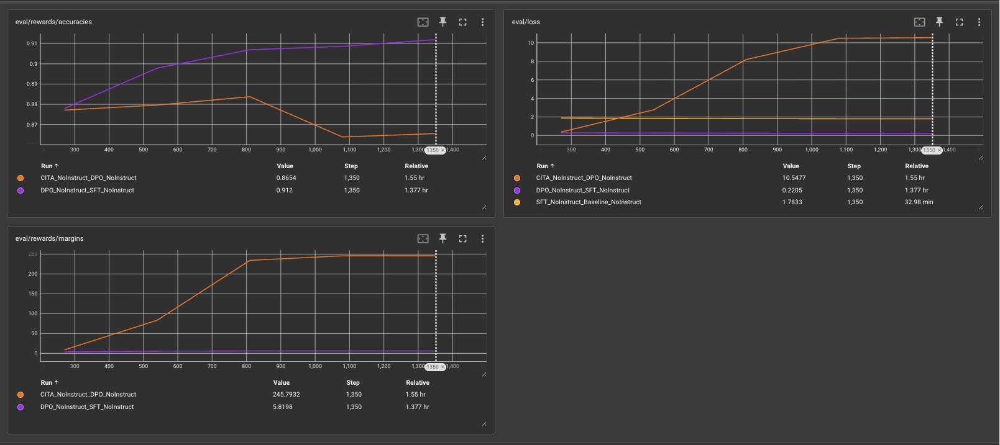
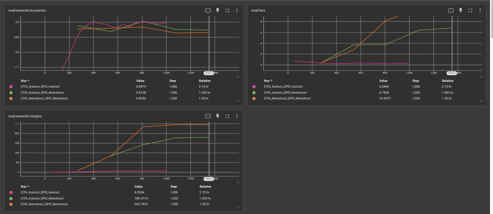
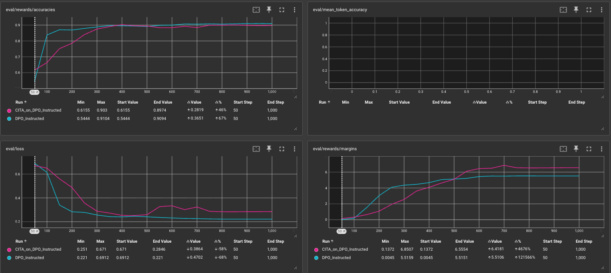
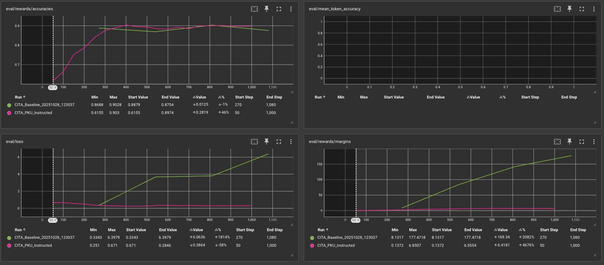

# CITA Training Instability - Root Cause Analysis

**Date**: 2025-11-02
**Issue**: CITA explodes when stacked on DPO_NoInstruct
**Root Cause**: DPO_NoInstruct incompatible with CITA's KL regularization (NOT distribution mismatch)

---

## Executive Summary

**Experiments**:
1. ✅ CITA_Instruct + DPO_Instruct → STABLE (margin 6.56)
2. ❌ CITA_Instruct + DPO_NoInstruct → EXPLODES (margin 180)
3. ❌ CITA_NoInstruct + DPO_NoInstruct → EXPLODES WORSE (margin 246)

**Key Finding**: Run #3 has perfectly aligned distributions (both NO instructions), yet **still explodes**. This **disproves distribution mismatch theory**.

**Conclusion**: Instructions must be in ALL stages (SFT→DPO→CITA) for stability.

---

## TensorBoard Evidence

### 1. Instructed Pipeline (STABLE)


| Method | Margin | Loss | Status |
|--------|--------|------|--------|
| SFT_Instruct | - | 1.51 | ✅ Stable |
| DPO_Instruct | 5.52 | 0.22 | ✅ Stable |
| CITA_Instruct | **6.56** | 0.28 | ✅ **+18.9% margin** |

All stages use instructions → smooth convergence.

---

### 2. NoInstruct Pipeline (CITA EXPLODES)


| Method | Margin | Loss | Status |
|--------|--------|------|--------|
| SFT_NoInstruct | - | 1.78 | ✅ Stable |
| DPO_NoInstruct | 5.82 | 0.22 | ✅ **STABLE** |
| CITA_NoInstruct | **246** | 10.5 | ❌ **EXPLODES** |

**Key**: DPO_NoInstruct itself is stable, but CITA on top explodes (margins 5.8 → 246 after step 400). Proves DPO works without instructions, but CITA doesn't.

---

### 3. All CITA Runs Comparison


| Run | DPO Base | CITA Format | Margin | Status |
|-----|----------|-------------|--------|--------|
| 🟣 Pink | Instruct | WITH instruct | 6.56 | ✅ STABLE |
| 🟢 Green | NoInstruct | WITH instruct | 180 | ❌ EXPLODES |
| 🟠 Orange | NoInstruct | NO instruct | **246** | ❌ **EXPLODES WORSE** |

**Critical**: Orange run has **aligned distributions** (both NO instructions), yet explodes WORSE. This **disproves distribution mismatch theory**.

---

### 4. Instructed DPO Comparison (Legacy)


Shows DPO_Instruct (blue) vs CITA_Instruct (pink). Both stable, CITA improves margins (5.5 → 6.6).

---

### 5. NoInstruct DPO Comparison (Legacy)


Shows DPO_NoInstruct (purple, stable) vs CITA_NoInstruct (green, explodes). Same data as Figure 2 but different visualization.

---

### 6. Unstable CITA Detail


Close-up of CITA_NoInstruct explosion: margins 8 → 180, loss 0.33 → 6.79 over 1350 steps.

---

## Root Cause

**Experimental Evidence**:

| DPO Base | CITA Format | Result | Aligned? |
|----------|-------------|--------|----------|
| Instruct | WITH instruct | ✅ STABLE | Yes |
| NoInstruct | WITH instruct | ❌ EXPLODES | No |
| NoInstruct | NO instruct | ❌ **EXPLODES WORSE** | **Yes** |

**Key**: Row 3 has aligned distributions, yet explodes worse. **Disproves distribution mismatch theory**.

**Actual Pattern**:
- ✅ ANY CITA on DPO_Instruct → Stable
- ❌ ANY CITA on DPO_NoInstruct → Explodes

**Possible Causes**:
1. KL regularization breaks down when reference model (DPO_NoInstruct) lacks instruction conditioning
2. Instructions serve as implicit regularization during DPO, without which models become fragile for CITA

---

## Solution

**Use existing CITA_Instruct model** (from v0_pku_all_instructed branch):
- Already trained and stable (margin 6.56, +18.9% over DPO)
- No retraining needed

**Action**:
```bash
python comparative_study/05_evaluation/llm_as_judge/toxicity.py --mode full
```

**Models**:
- SFT_NoInstruct: `kapilw25/llama3-8b-pku-SFT-NoInstruct-Baseline-NoInstruct`
- DPO_NoInstruct: `kapilw25/llama3-8b-pku-DPO-NoInstruct-SFT-NoInstruct`
- CITA_Instruct: From v0_pku_all_instructed branch

---

### What Doesn't Work

❌ **Training CITA_NoInstruct** (tested, explodes worse: margin 246)
❌ **Gradient clipping alone** (masks symptoms, doesn't fix root cause)
❌ **Lower learning rate** (slows explosion, doesn't prevent it)

---

## Next Steps

1. ✅ Analysis complete - distribution mismatch theory disproven
2. ✅ Instructions must be in ALL stages (SFT→DPO→CITA)
3. ⏳ Run toxicity evaluation with existing stable models
4. ⏳ Compare: SFT vs DPO vs CITA toxicity scores

---

## References

**Logs**:
- Stable: `logs_training/iter4/logs/CITA_Baseline_training_20251025_000641.log`
- Unstable: `logs/CITA_Baseline_training_20251102_032459.log`
- Code: `github.com/kapilw25/finetuning_evaluation/tree/v0_pku_all_instructed`

**TensorBoard Figures**:
1. `tensorboard_only_instruct.png` - Instructed pipeline (all stable)
2. `tensorboard_only_NoInstruct.png` - NoInstruct pipeline (CITA explodes)
3. `tensorboard_only_CITA.png` - All CITA runs (disproves mismatch theory)
4. `Instructed_DPO.png` - Legacy: DPO vs CITA (instructed)
5. `not_instructed_DPO.png` - Legacy: DPO vs CITA (no instruct)
6. `Tensorboard_unstable_CITA.png` - Close-up of explosion
