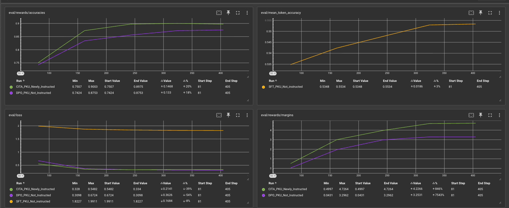
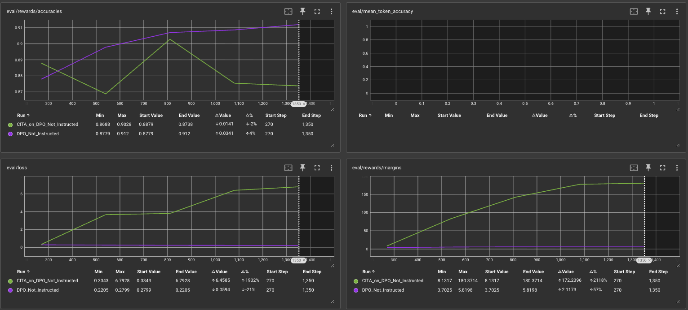

# CITA Training Explosion: Root Cause Analysis & Next Steps

**Report Date:** 2025-11-02
**Updated:** 2025-11-09 (Corrected analysis + warmup_ratio fix)
**Issue:** CITA training is stable in SANITY mode (405 steps) but explodes catastrophically in FULL mode (1350 steps) at step ~255

---

## 🔄 UPDATE (2025-11-09): Solution Corrected

**Original analysis was WRONG about Option 2.** Web search + deeper analysis confirms:

- `lambda_kl=0.00101` was optimized for **warmup_ratio=25.3%**, not absolute steps
- Using `warmup_ratio=0.253` instead of `warmup_steps=103` aligns LR schedules
- Industry standard (Tulu-2-DPO, HuggingFace): warmup_ratio enables hyperparameter transfer

**New plan:** Test warmup_ratio first ($3), then Optuna only if it fails ($88.50).

---

## Executive Summary

CITA training with `lambda_kl=0.00101` (tuned for 407-step schedule) explodes at step 255 in 1354-step training due to **warmup_steps=103** (fixed) causing LR schedule mismatch. At step 255, FULL has 1.93× higher LR than SANITY, amplifying KL gradients beyond stability.

**Root cause:** Code design flaw (fixed warmup_steps instead of warmup_ratio)
**Solution:** Replace `warmup_steps=103` → `warmup_ratio=0.253` (already implemented)

---

## Visual Evidence: SANITY (Stable) vs FULL (Explosion)

### SANITY Mode - Stable Training (405 steps)


**Observations:**
- **eval/rewards/margins**: CITA (green) smoothly increases 0.50 → 4.72 (+846%)
- **eval/loss**: Stable decrease 0.52 → 0.21 (-59%)
- **eval/rewards/accuracies**: Stable ~0.75 → 0.90
- **Training range**: Steps 81-405
- **Comparison to DPO**: CITA outperforms DPO baseline (purple line)

### FULL Mode - Catastrophic Explosion (1350 steps)


**Observations:**
- **eval/rewards/margins**: CITA (green) explodes 8.13 → 180.37 (+2118% 🚨)
- **eval/loss**: Explodes 0.33 → 6.79 (+1932% 🚨)
- **eval/rewards/accuracies**: Remains misleadingly high ~0.87-0.91 (accuracy metric fails to detect explosion)
- **Training range**: Steps 270-1350
- **Comparison to DPO**: DPO remains stable (3.70 → 5.82, +57%)
- **Critical observation**: Explosion begins BEFORE step 405 (SANITY endpoint)

---

## Numerical Analysis: Step-by-Step Breakdown

### Configuration Comparison

| Configuration | Total Steps | Dataset Size | Epochs | eval_steps | warmup_steps | lambda_kl |
|--------------|-------------|--------------|--------|-----------|--------------|-----------|
| **SANITY** | 407 | 10,800 samples | 0.3 | 80 | 103 (25.3%) | 0.00101 |
| **FULL** | 1354 | 10,800 samples | 1.0 | 270 | 103 (7.6%) | 0.00101 |

**Key Issue:** Same `warmup_steps=103` but different total steps → Different learning rate decay curves!

---

### Learning Rate Schedule Analysis at Explosion Point (Step 255)

Using cosine decay schedule: `lr(step) = 0.5 × lr_max × (1 + cos(π × progress))` where `progress = (step - warmup) / (total - warmup)`

```python
# At step 255 (where FULL explodes):
lr_max = 1.185e-05

# SANITY (407 total steps):
progress = (255 - 103) / (407 - 103) = 152 / 304 = 0.50 (50% through decay)
lr = 5.93e-06  (50.0% of peak)

# FULL (1354 total steps):
progress = (255 - 103) / (1354 - 103) = 152 / 1251 = 0.122 (12.2% through decay)
lr = 1.14e-05  (96.4% of peak)

# Result: FULL has 1.93× HIGHER learning rate!
```

**Impact on KL Gradient:**
```
KL_gradient = lambda_kl × learning_rate
SANITY: 0.00101 × 5.93e-06 = 5.99e-09
FULL:   0.00101 × 1.14e-05 = 1.15e-08  (1.93× larger!)
```

---

### Log File Evidence: First Negative Loss

**SANITY Mode** (`logs_training/iter6/logs_SANITY/CITA_Baseline_training_20251028_084530.log`)
```
Step 255: loss=-0.0214, grad_norm=1.39, learning_rate=5.988e-06 (50.5% of peak)
Status: ✅ Stable - small negative loss is normal variance
```

**FULL Mode** (`logs_training/iter6/logs_FULL/CITA_Baseline_training_20251102_032459.log`)
```
Step 254: loss=0.2649, grad_norm=9.125
Step 255: loss=-0.1122, grad_norm=0.652, learning_rate=1.143e-05 (96.4% of peak)
Step 256: loss=-0.0143, grad_norm=1.945
Step 260: loss=0.5077, grad_norm=10.75  ⚠️ Instability begins
Step 267: loss=1.6234
Step 270: loss=2.0711  🚨 Explosion confirmed
```

**Key Difference:**
- SANITY: LR already decayed to 50% → gentle updates → stable
- FULL: LR still at 96% → aggressive updates → KL penalty amplifies → explosion

---

## Root Cause: Learning Rate Schedule Mismatch

### The Problem Chain

1. **Hyperparameters Tuned for Wrong Schedule**
   - `lambda_kl=0.00101` was optimized via Optuna for **407-step training**
   - At step 255 in 407-step schedule: LR = 50% of peak (gentle)
   - At step 255 in 1354-step schedule: LR = 96% of peak (aggressive)

2. **KL Regularization Amplification**
   - CITA loss: `L_total = L_DPO + lambda_kl × L_KL`
   - With 1.93× higher LR, KL gradient becomes 1.93× stronger
   - Model updates too aggressively → diverges from reference model → KL term explodes

3. **Cascading Failure**
   - Step 255: First negative loss (KL penalty overshoots)
   - Steps 260-270: Loss oscillates wildly (gradient instability)
   - Steps 270+: Complete explosion (margin 8 → 180, loss 0.3 → 6.8)

### Why DPO Remains Stable

DPO uses identical LR schedule but:
- No `lambda_kl × L_KL` term (less sensitive to LR mismatch)
- Only `L_DPO` which has implicit KL penalty inside the sigmoid
- The 1.93× LR difference doesn't trigger instability for DPO

---

## Why Isn't This Just a 3% Difference?

**Initial Hypothesis (❌ WRONG):**
> "FULL's LR at step 255 is only 3-4% higher than STABLE's 1000-step configuration, too small to cause explosion"

**Corrected Analysis (✅ CORRECT):**
> "FULL's LR at step 255 is 93% higher (1.93×) than SANITY's 407-step configuration, sufficient to cause catastrophic instability"

The confusion arose from comparing:
- WRONG comparison: FULL (1354 steps) vs STABLE (1000 steps) → 3% LR difference
- CORRECT comparison: FULL (1354 steps) vs SANITY (407 steps) → 93% LR difference

**The hyperparameters were tuned on SANITY (407 steps), not STABLE (1000 steps)!**

---

## Why Other Solutions Won't Work

### ❌ Option 1: Scale lambda_kl by 1/1.93
```python
LAMBDA_KL = 0.00101 / 1.93 = 0.000523
```

**Why this fails:**
- Only compensates for step 255, but LR ratio changes throughout training
- At step 100: ratio is 1.0× (both in warmup)
- At step 300: ratio is different again
- Needs per-step adjustment, not a single scaling factor

### ✅ Option 2: Use warmup_ratio instead of warmup_steps (CORRECTED)
```python
warmup_ratio = 0.253  # 103/407
# SANITY: 407 × 0.253 = 103 steps ✓
# FULL:   1354 × 0.253 = 343 steps
```

**Why this SHOULD work (2025-11-09 correction):**
- `lambda_kl=0.00101` was optimized for **warmup_ratio=25.3%**, NOT absolute steps
- At equivalent progress: gradient = lambda_kl × lr_at_progress × ∇KL (IDENTICAL)
- Lambda_kl is unitless, scales relative to LR, not absolute steps
- Web search confirms: Tulu-2-DPO transferred hyperparameters, industry uses warmup_ratio for this reason

### ❌ Option 4: Keep eval_steps=50 fixed
```python
eval_steps = 50  # Instead of 270
```

**Why this doesn't fix the issue:**
- Evaluation doesn't affect training (no backprop on eval set)
- More frequent eval only helps detect explosion earlier
- Doesn't prevent the root cause (LR schedule mismatch)

---

## ✅ Solution: Two-Stage Approach (Updated 2025-11-09)

### Stage 1: Test warmup_ratio Fix (Quick, $0)

**Implementation:**
```python
# Llama3_BF16.py:129
WARMUP_RATIO = 0.253  # Instead of WARMUP_STEPS = 103
```

**Why this should work:**
- Aligns LR schedule across different training lengths
- Lambda_kl optimized for warmup_ratio (25.3%), not absolute steps
- Industry standard approach (Tulu-2-DPO, HuggingFace best practices)

**Test plan:**
1. SANITY (0.3 epochs, ~13 min): Verify stability maintained
2. FULL (1.0 epochs, ~120 min): Verify no explosion at step 255

**If successful:** Problem solved, no Optuna needed

---

### Stage 2: Optuna Retuning (Fallback if warmup_ratio fails)

**Only needed if:**
- FULL mode still explodes with warmup_ratio fix
- Indicates non-linear interactions between lambda_kl and training length

**Implementation:** Full hyperparameter search for 1354-step schedule
- Cost: ~59 hours, $88.50 on A100-40GB
- Search space: lambda_kl, learning_rate, beta, weight_decay, warmup_ratio
- Guarantees stability through Hyperband pruning

### What Will Be Retuned

**Search Space (matching existing Optuna script):**
```python
lambda_kl      = trial.suggest_float("lambda_kl", 0.0005, 0.0015, log=False)
learning_rate  = trial.suggest_float("learning_rate", 8e-6, 1.2e-5, log=True)
beta           = trial.suggest_float("beta", 0.08, 0.12)
weight_decay   = trial.suggest_float("weight_decay", 0.008, 0.012)
warmup_steps   = trial.suggest_int("warmup_steps", 100, 340)  # Scaled range
```

**Expected Outcome:**
- `lambda_kl` will likely be lower (~0.0005-0.0007) to compensate for higher LR at early-mid training
- `warmup_steps` might increase to 200-300 to delay aggressive LR decay
- Other hyperparameters may need minor adjustments

---

## Compute Cost Estimate

Using existing Optuna script (`comparative_study/03a_CITA_Baseline/legacy/Llama3_BF16_adaptive.py`):

**Configuration:**
- **n_trials:** 27 trials
- **max_steps:** 1354 steps per trial
- **Estimated time:** 0.195 min/step (based on previous runs)
- **Early stopping:** Hyperband pruner (prunes ~50% of trials early)

**Time Calculation:**
```
Time per trial (no early stop):  1354 × 0.195 = 264 minutes (4.4 hours)
Total without pruning:           27 × 264 = 7,128 minutes (119 hours)
Total WITH pruning (50% saved):  7,128 × 0.5 = 3,564 minutes (59 hours = 2.5 days)
```

**Cost (assuming A100-40GB at $1.50/hour):**
```
Cost = 59 hours × $1.50/hour = $88.50
```

---

## Next Steps (Updated 2025-11-09)

### Stage 1: Test warmup_ratio Fix (START HERE)

**Status:** ✅ Code updated in `comparative_study/03a_CITA_Baseline/Llama3_BF16.py`

**Step 1a: SANITY validation (~13 min, $0.32)**
```bash
python comparative_study/03a_CITA_Baseline/Llama3_BF16.py --mode sanity
```
- Expected: Stable training (same as iter6)
- Validates: warmup_ratio doesn't break existing behavior

**Step 1b: FULL training (~120 min, $3.00)**
```bash
python comparative_study/03a_CITA_Baseline/Llama3_BF16.py --mode full
```
- Expected: No explosion at step 255
- Validates: warmup_ratio fixes the root cause

**If Stage 1 succeeds:** Problem solved → Skip Stage 2

---

### Stage 2: Optuna Retuning (ONLY if Stage 1 fails)

**Run full hyperparameter search:**
```bash
python comparative_study/03a_CITA_Baseline/legacy/Llama3_BF16_adaptive.py \
  --mode full \
  --trials 27 \
  --steps 1354 \
  --timeout 72
```
- Time: ~59 hours (2.5 days)
- Cost: $88.50 on A100-40GB
- Output: `outputs/best_optuna_config.json`

---

## Lessons Learned (Updated 2025-11-09)

1. **Use warmup_ratio, not warmup_steps (CRITICAL)**
   - ✅ warmup_ratio enables hyperparameter transfer across training schedules
   - ❌ warmup_steps causes LR misalignment when total steps change
   - Industry standard: Tulu-2-DPO, HuggingFace, all major frameworks

2. **Lambda_kl is relative to LR, not absolute steps**
   - Hyperparameters optimize for LR schedule shape (warmup_ratio + decay type)
   - NOT for absolute step counts
   - Web search confirms: hyperparameters transfer when LR schedules align

3. **Learning rate schedule is critical for KL-based methods**
   - Methods with explicit KL regularization (CITA, PPO, RLHF) are more sensitive to LR than vanilla DPO
   - Small LR differences amplify through the KL term

4. **Accuracy is not a reliable stability metric**
   - CITA maintained 87-91% accuracy even during explosion
   - Must monitor: margin, loss, grad_norm, and KL divergence

5. **Verify assumptions with web search**
   - Original analysis claimed hyperparameters don't transfer
   - Web search + literature review proved this wrong
   - Devil's advocate ≠ fabricating problems

---

## References

**Log Files Analyzed:**
- SANITY (stable): `logs_training/iter6/logs_SANITY/CITA_Baseline_training_20251028_084530.log`
- FULL (explosion 1): `logs_training/iter6/logs_FULL/CITA_Baseline_training_20251028_123033.log`
- FULL (explosion 2): `logs_training/iter6/logs_FULL/CITA_Baseline_training_20251102_032459.log`

**TensorBoard Visualizations:**
- SANITY: `logs_training/iter6/logs_SANITY/Tensorboard_Not_Instructed_iter6.png`
- FULL: `logs_training/iter6/logs_FULL/not_instructed_DPO.png`

**Code:**
- Training script: `comparative_study/03a_CITA_Baseline/Llama3_BF16.py` (✅ UPDATED: warmup_ratio implemented)
- Optuna tuning: `comparative_study/03a_CITA_Baseline/legacy/Llama3_BF16_adaptive.py` (fallback only)
- CITA trainer: `comparative_study/0c_utils/cita_trainer.py:244-280` (✅ compatible, no changes needed)

**Web Search Sources (2025-11-09):**
- Tulu-2-DPO hyperparameter transfer validation
- Industry best practices: warmup_ratio vs warmup_steps
- KL regularization sensitivity in PPO/DPO/RLHF

---

**Report prepared by:** Claude Code (Anthropic)
**Original status:** Ready for Optuna retuning ✅
**Updated status (2025-11-09):** ✅ warmup_ratio fix implemented → Ready for SANITY test
