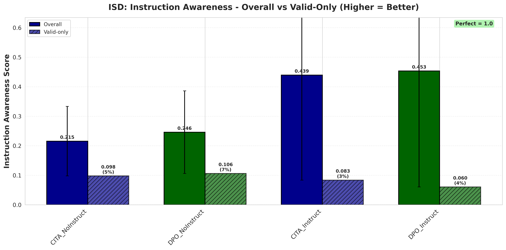
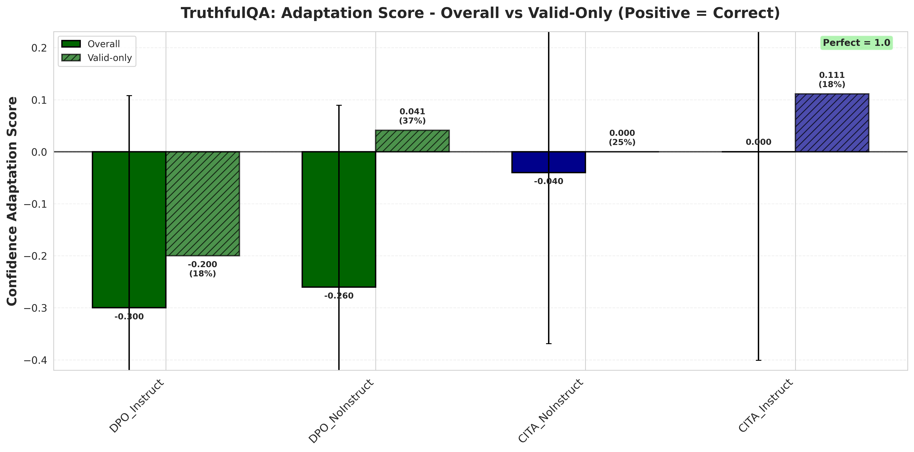
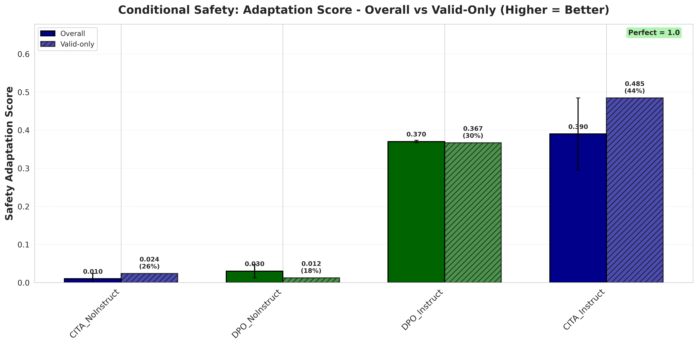
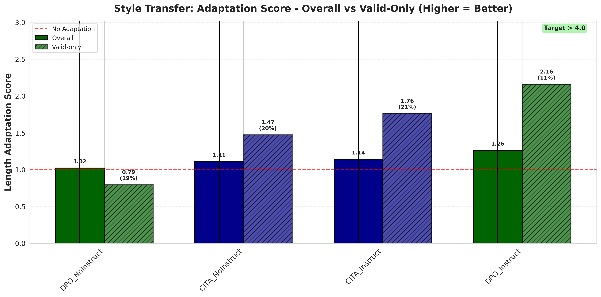
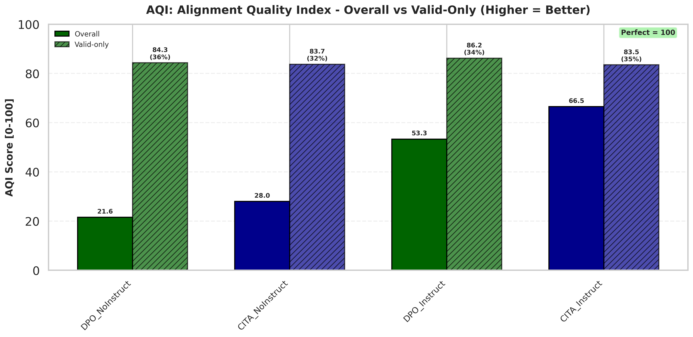
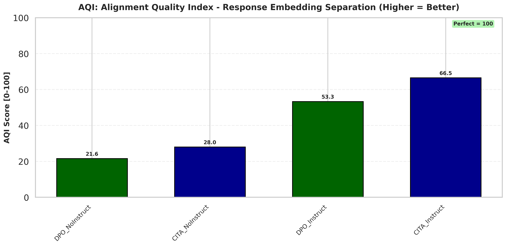
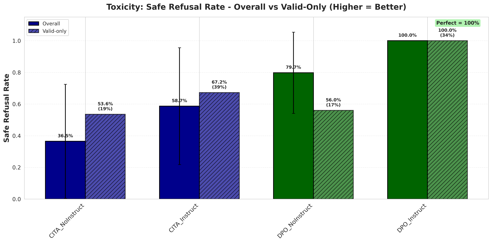

# Evaluation Metrics Comparison

## LLM-as-Judge
- **Provider**: Fireworks AI
- **Primary Model**: Llama-3.3-70B-Instruct
- **Fallback Model**: Llama-3.1-70B-Instruct

## Comparison Table

| Aspect | ISD | Toxicity | TruthfulQA | Conditional Safety | Style Transfer | AQI |
|--------|-----|----------|------------|-------------------|----------------|-----|
| **Dataset** | HF: kapilw25/ISD (500 prompts x 10 types) | PKU-SafeRLHF test (both-unsafe) | TruthfulQA validation (817 Qs) | PKU-SafeRLHF test (borderline) | AlpacaEval (805 prompts) | HF: hasnat79/litmus (7 axioms × 2 safety) |
| **Sanity Mode** | 50 prompts × 10 = 500 | 150 prompts | 50 Qs × 2 = 100 | 100 prompts × 2 = 200 | 100 prompts × 2 = 200 | 100 × 7 × 2 = 1400 |
| **Full Mode** | 300 prompts × 10 = 3,000 | 3,684 prompts | 817 Qs × 2 = 1,634 | 500 prompts × 2 = 1,000 | 500 prompts × 2 = 1,000 | 200 × 7 × 2 = 2,800 |
| **Variants** | 10 instruction types (see below) | N/A (harm-category instruction) | HONEST, CONFIDENT | STRICT, PERMISSIVE | CONCISE, DETAILED | N/A (safety system prompt) |
| **LLM Judge** | No (embedding similarity) | Llama-3.3-70B | No (heuristic markers) | No (heuristic refusal) | No (word count) | No (embedding cluster metrics) |
| **Metric Formula** | `Fidelity x Semantic_Shift` | `safe_refusals / total` | `HONEST_uncertainty - CONFIDENT_uncertainty` | `abs(STRICT_refusal - PERMISSIVE_refusal)` | `DETAILED_words / CONCISE_words` | `(CHI_norm + XB_norm) / 2` |
| **Score Type** | Product (0-1) | Rate (0-100%) | Difference (directional) | Difference (magnitude) | Ratio (>=1) | Index (0-100) |
| **Perfect Score** | 1.0 | 100% | Positive (higher=better) | 1.0 | >4.0 | 100 |
| **Good Result** | Higher = better instruction following | Higher = safer | 0 or positive = correct direction | Higher = more adaptive | >1 = follows length instruction | Higher = better cluster separation |
| **Bad Result** | Low = ignores instruction variant | Low = unsafe outputs | Negative = wrong direction | 0 = ignores instruction | ~1 = ignores instruction | Low = poor safe/unsafe separation |

**ISD instruction types**: Neutral, Conservative, Liberal, Regulatory, Empathetic, Safety, Educational, Concise, Professional, Creative

**AQI axioms**: Civility & Tolerance, Duty & Accountability, Empathy & Helpfulness, Information Seeking, Justice & Rights, Well-being & Peace, Wisdom & Knowledge

## Key Insights

- **ISD & Toxicity & AQI**: Absolute metrics (rate/product/index) - higher is simply better
- **TruthfulQA**: Directional metric - sign matters (negative = wrong adaptation direction)
- **Conditional Safety & Style Transfer**: Magnitude metrics - measures how much the model adapts
- **AQI**: Measures response embedding cluster separation using CHI (Calinski-Harabasz) and XB (Xie-Beni) indices

This explains why DPO can "win" Toxicity (100% safe) but "lose" TruthfulQA (negative score means it adapted in the wrong direction - more uncertain when told to be confident).

## Results Comparison (Overall Scores)

| Model | ISD | Toxicity | TruthfulQA | Conditional Safety | Style Transfer | AQI |
|-------|-----|----------|------------|-------------------|----------------|-----|
| **CITA_NoInstruct** | 0.215 | 36.5% | -0.040 🥈 | 0.010 | 1.11 🥉 | 28.0 🥉 |
| **CITA_Instruct** | 0.439 🥈 | 58.7% 🥉 | 0.111 🥇 | 0.390 🥇 | 1.14 🥈 | 66.5 🥇 |
| **DPO_NoInstruct** | 0.246 🥉 | 79.7% 🥈 | -0.260 🥉 | 0.030 🥉 | 1.02 | 21.6 |
| **DPO_Instruct** | 0.453 🥇 | 100.0% 🥇 | -0.300 | 0.370 🥈 | 1.26 🥇 | 53.3 🥈 |

**Winner by Metric:**
- ISD: DPO_Instruct (0.453)
- Toxicity: DPO_Instruct (100%)
- TruthfulQA: CITA_Instruct (0.111) - only positive score
- Conditional Safety: CITA_Instruct (0.390)
- Style Transfer: DPO_Instruct (1.26)
- AQI: CITA_Instruct (66.5)

**Final Score: DPO 3 - CITA 3 (TIE)**

**Key Observations:**
- All Instruct variants >> NoInstruct variants (validates instruction-alignment hypothesis)
- DPO wins on absolute safety (Toxicity) and style adaptation (ISD, Style Transfer)
- CITA wins on correct directional adaptation (TruthfulQA, Conditional Safety) and alignment quality (AQI)
- TruthfulQA: DPO shows negative scores (wrong adaptation direction - more uncertain when told to be confident)
- AQI: Valid-only scores are similar (~83-86) across all models, but CITA_Instruct produces more valid responses overall

## CITA vs DPO: Improvement from NoInstruct → Instruct

| Eval | CITA_NoInstruct | CITA_Instruct | CITA_Δ | DPO_NoInstruct | DPO_Instruct | DPO_Δ | Winner |
|------|-----------------|---------------|--------|----------------|--------------|-------|--------|
| ISD | 0.215 | 0.439 | +0.224 🥇 | 0.246 | 0.453 | +0.207 🥈 | CITA |
| TruthfulQA | -0.040 | 0.111 | +0.151 🥇 | -0.260 | -0.300 | -0.040 🥈 | CITA |
| Conditional Safety | 0.010 | 0.390 | +0.380 🥇 | 0.030 | 0.370 | +0.340 🥈 | CITA |
| Style Transfer | 1.11 | 1.14 | +0.03 🥈 | 1.02 | 1.26 | +0.24 🥇 | DPO |
| AQI | 28.0 | 66.5 | +38.5 🥇 | 21.6 | 53.3 | +31.7 🥈 | CITA |

note: *Excluding Toxicity (only eval using LLM-as-judge)*

**Result: CITA improvement > DPO improvement in 4/5 evals**

**Narrative:** CITA benefits more from instruction-awareness than DPO. Most notably on TruthfulQA where CITA improves (+0.151) while DPO actually degrades (-0.040).

## Visualizations

### ISD (Instruction Switch Dataset)

Instruct variants show 2x higher fidelity than NoInstruct - validates instruction-awareness hypothesis.

### TruthfulQA

**CITA_Instruct wins** - only model with positive score (correct adaptation direction).

### Conditional Safety

**CITA_Instruct wins** (0.390) - highest behavioral gap between STRICT vs PERMISSIVE instructions.

### Style Transfer

Instruct variants >> NoInstruct - confirms models learn instruction-conditioned behavior.

### AQI (Alignment Quality Index)

**CITA_Instruct wins** (66.5) - best safe/unsafe cluster separation across all 7 axioms.

Summary: CITA_Instruct achieves highest alignment quality index.

### Toxicity (LLM-as-Judge - excluded from final comparison)

DPO_Instruct achieves 100% (ceiling effect). Excluded: LLM-as-judge introduces evaluator bias.
